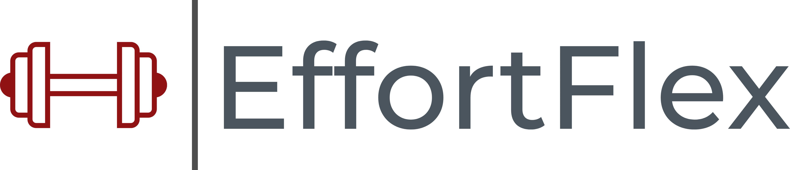
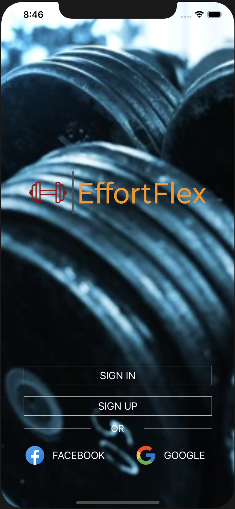
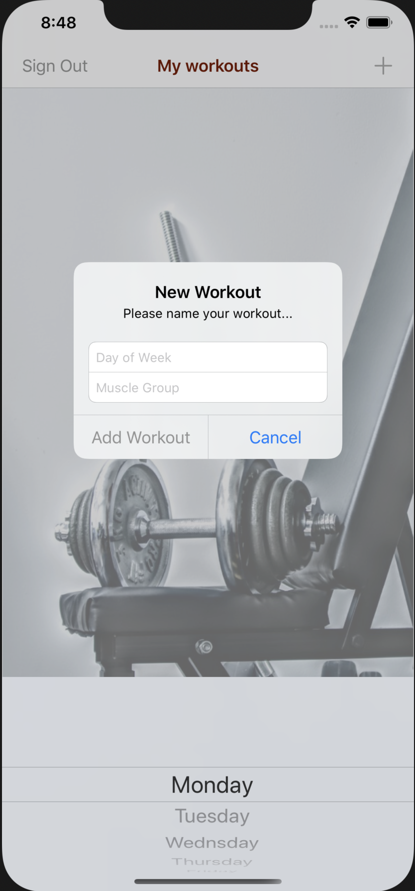
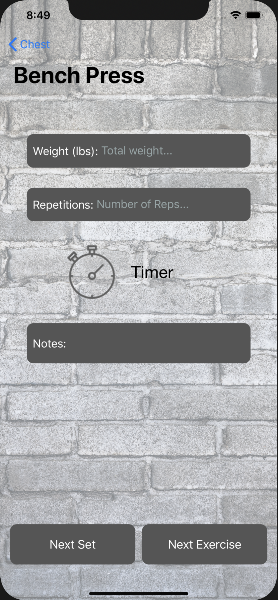
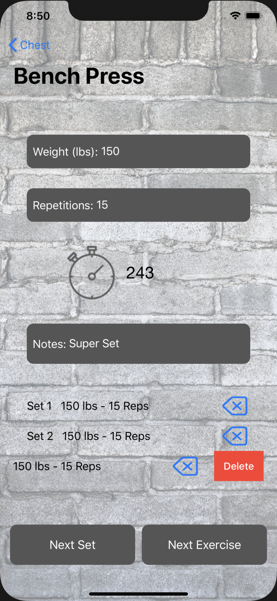

> A clean and simple workout log app created with Swift 5.

## Table of contents
* [General info](#general-info)
* [Screenshots](#screenshots)
* [Technologies](#technologies)
* [Setup](#setup)
* [Features](#features)
* [Status](#status)
* [Inspiration](#inspiration)
* [Contact](#contact)

## General info
The purpose of this project is to build a workout log app with a very minimalistic design in order
to emphasize the most essential components of a workout app, namely the date, the targeted muscle groups,
the exercises, the weight and repetitions for each workout set, as well as a timer to keep track of breaks in between sets. 

As an avid gym goer and fitness enthusiast, I was motivated to build this app when I started looking for workout logging apps 
that were very simple and rudimentary in function and deisgn. Most apps that I would come across would have a myriad of customizable options 
and would have you select from a number of pre-determined workouts or exercises, which was nice but it wasn't quite what I was looking for. 
What I wanted to achieve was the freedom to name my own workouts/muscle groups/exercises without having to choose from a limited list of options. 
I also wanted to avoid cluttering the UI as much as possible, which is why I kept the UI simple and to the point.

## Screenshots
    

## Technologies
* Swift 5
* Firebase SDK
* Cocoapods Version 1.9.3
* DEPENDENCIES:
  - FBSDKCoreKit (7.1.1)
  - FBSDKLoginKit (7.1.1)
  - Firebase/Analytics (6.6.1)
  - Firebase/Auth (6.6.0)
  - Firebase/Core (6.8.0)
  - FirebaseFirestoreSwift (0.3.0)
  - GoogleSignIn (5.0.2)
  - IQKeyboardManagerSwift (6.5.5)
  - RealmSwift (5.2.0)

## Setup
Describe how to install / setup your local environement / add link to demo version.

## Code Examples
Show examples of usage:
`put-your-code-here`

## Features
List of features ready and TODOs for future development
* Awesome feature 1
* Awesome feature 2
* Awesome feature 3

To-do list:
* Wow improvement to be done 1
* Wow improvement to be done 2

## Status
Project is: _in progress_, _finished_, _no longer continue_ and why?

## Inspiration
Add here credits. Project inspired by..., based on...

## Contact
Created by [@flynerdpl](https://www.flynerd.pl/) - feel free to contact me!
